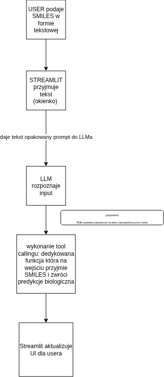

## Pytania na ktore nalezalo odpowiedziec
- jak ograniczyliscie dane
- jakie cechy podobieralem
- jaka wyszla krzywa uczenia
- jaka to jest architektura sieci (GCN czy GNN)
- jakie byly dropouty
- jakie wyszlo r2
- jaka byla rozpietosc molekul (ile bylo duzych molekul po kilkaset atomow)
- czy byly duplikaty w danych zrodlowych?

## Dodatkowe info od Macka
- dodatek od Macka: najlepiej wychodzilo bialko JAK2 do uczenia (id to 2147)

## Poprawki sugerowane pprzez Macka odnosnie mojej pracy
* przemodelowanie architektury
	- model jest zaciasny (dodac warstwy)
	- popracowac nad wspolczynnikiem dropout do 20%
	- dodac virtual node
	- jesli jest GCN to zadac 4 rozne poolingy (min, add, max, min+max)

## Notatki do odpowiedzi na pytania

## Jak ograniczylismy dane

- Zrodlo: ChEMBL (SQLite), tylko cele: `CHEMBL220`, `CHEMBL4822`, `CHEMBL3177` (cele zwiazane z Alzheimerem).
- Filtry na etapie pobierania (ETL):
  - `canonical_smiles` != NULL
  - `pchembl_value` != NULL
  - `potential_duplicate` IS NULL lub = 0
- Uzupelnianie jednostek: jesli `standard_units` brak i `standard_value` w zakresie 0.01..1e6, przyjmujemy `nM`.
- Wyliczenie `pIC50 = -log10(standard_value * 1e-9)` dla `standard_units == nM`, w innym przypadku pozostaje `pchembl_value`.
- Czyszczenie finalne: usuniecie rekordow z `pIC50` NULL lub nieskonczonym; deduplikacja po `canonical_smiles`.
- W `learning.ipynb` dodatkowo: odrzucenie czasteczek z niepoprawnym SMILES (brak fingerprintu) oraz NaN w `pIC50`.
- Liczba probek po czyszczeniu w `learning.ipynb`: 15 723.

## Jakie cechy pobieralem

Sa dwie reprezentacje (dwa modele):

1) MLP (fingerprinty)
- Morgan fingerprint (ECFP) z RDKit, radius=2, rozmiar 2048 bitow.
- Wejscie to wektor 2048 cech na czasteczke.

2) GNN (graf molekularny)
- Cechy wezlow (atomow):
  - one-hot atomow z listy: [1, 5, 6, 7, 8, 9, 14, 15, 16, 17, 34, 35, 53]
  - one-hot hybrydyzacji: SP, SP2, SP3, SP3D, SP3D2
  - one-hot chiral tag: CHI_UNSPECIFIED, CHI_TETRAHEDRAL_CW, CHI_TETRAHEDRAL_CCW
  - cechy numeryczne: degree, formal_charge, num_hs, total_valence, num_radical, is_aromatic, is_in_ring
- Cechy krawedzi (wiazan):
  - one-hot typ wiazania: SINGLE, DOUBLE, TRIPLE, AROMATIC
  - one-hot stereo: STEREONONE, STEREOZ, STEREOE, STEREOCIS, STEREOTRANS
  - flagi: is_conjugated, is_in_ring

## Jaka wyszla krzywa uczenia

W notebooku logowane sa srednie straty (avg_train_loss / avg_val_loss) oraz najlepsza val_loss. Nie ma osobnego wykresu krzywej, ale mozna ocenic trend po metrykach:

- MLP, random split: avg_train_loss=0.4257, avg_val_loss=0.4854, best_val_loss=0.4543, epoch_best=61, epochs_trained=73
- MLP, scaffold split: avg_train_loss=0.7985, avg_val_loss=0.7768, best_val_loss=0.6543, epoch_best=5, epochs_trained=17
- GNN, random split: avg_train_loss=0.8396, avg_val_loss=0.8469, best_val_loss=0.6076, epoch_best=69, epochs_trained=81
- GNN, scaffold split: avg_train_loss=0.8980, avg_val_loss=1.0462, best_val_loss=0.7915, epoch_best=50, epochs_trained=62

W praktyce stosowane jest early stopping po val_loss (patience=12), wiec trening zatrzymuje sie po ustabilizowaniu walidacji.

## Jaka to jest architektura sieci (GCN czy GNN)

- Architektura grafowa to GNN oparta o `GINEConv`.
- Warstwy: 4 x GINEConv z BatchNorm i polaczeniem rezydualnym, pooling globalny `mean`, head MLP.
- Dla MLP: 3 warstwy liniowe (2048 -> 512 -> 128 -> 1) z ReLU.

## Jakie byly dropouty

- MLP: dropout 0.2 po pierwszej i drugiej warstwie liniowej.
- GNN: dropout 0.10 w blokach GINE oraz w headzie (dropout w headzie dziedziczy ta sama wartosc).

## Jakie wyszlo R2

Walidacja (R2):

- MLP random split: 0.736981
- MLP scaffold split: 0.446912
- GNN random split: 0.649254
- GNN scaffold split: 0.461056

Nie liczono R2 na tescie (evaluate_test=False).

## Jaka byla rozpietosc molekul

W repozytorium nie ma gotowego podsumowania liczby atomow na czasteczke. Aby odpowiedziec precyzyjnie (np. ile czasteczek ma >=200/300/400 atomow), trzeba policzyc to z `processed_data/ChEMBL_processed.parquet` w srodowisku z RDKit.

## Czy byly duplikaty w danych zrodlowych

- Tak, potencjalne duplikaty sa czesciowo oznaczone w ChEMBL jako `potential_duplicate` i sa filtrowane na etapie pobierania.
- Dodatkowo, na koncu ETL wykonywana jest deduplikacja po `canonical_smiles`.
- W `learning.ipynb` pozostaja tylko unikalne struktury ze sprawnym SMILES i poprawnym `pIC50`.

